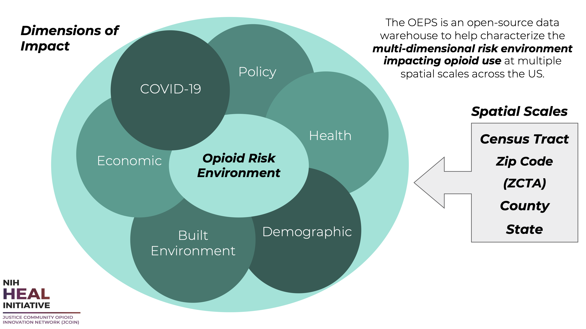

# OEPS Explorer
*Updated January 2022*

## About

The Opioid Environment Policy Scan (OEPS) is an open-source data warehouse that helps characterize helps characterize the multi-dimensional risk environment impacting opioid use and health outcomes across the United States. See the [master branch](https://github.com/GeoDaCenter/opioid-policy-scan) of this repo for more information.

The OEPS provides access to data at multiple spatial scales, from U.S. states down to Census tracts. It is designed to support research seeking to study environments impacting and impacted by opioid use and opioid use disorder (OUD), inform public policy, and reduce harm in communities nationwide. 

This repository stores scripts used to create the OEPS Explorer dashboard. We rely on [webgeoda scaffolding](http://dhalpern.gitbook.io/webgeoda-templatesBtw) to generate this dashboard. 

The OEPS Explorer lives at https://oeps.ssd.uchicago.edu/.

This project is led by the Healthy Regions & Policies Lab at the Center for Spatial Data Science, University of Chicago. 

### Citation
Susan Paykin, Dylan Halpern, Qinyun Lin, Moksha Menghaney, Angela Li, Rachel Vigil, Margot Bolanos Gamez, Alexa Jin, Ally Muszynski, and Marynia Kolak. (2021). GeoDaCenter/opioid-policy-scan: Opioid Environment Policy Scan Data Warehouse (v1.0). Zenodo. http://doi.org/10.5281/zenodo.4747876

## Data Overview

Variable constructs have been grouped thematically to highlight the multi-dimensional risk environment of opioid use in justice populations.  The variable themes are: **Geographic Boundaries, Policy, Health, Demographic, Economic, Physical Environment,** and **COVID-19**.

View the full Data Overview in the table [here](https://github.com/GeoDaCenter/opioid-policy-scan#data-overview). 

## WebGeoDa Scaffolding

WebGeoDa Scaffolding is a set of easy-to-use frontend JavaScript toolkits to get started building and exploring client-side geospatial analytics.

⚠️ Heads up! This repository is an _unstable_ work in progress. This means a lot will change in future releases. ⚠️

## About Webgeoda Scaffolding

**What is this thing?**

WebGeoDa is a set of tools, templates, and scaffolding to quickly and easily develop geospatial data dashboards. WebGeoDa builds on the GeoDa suite of geospatial software and extends jsGeoDa through accessible and ready-to-go examples. WebGeoDa uses  [jsGeoDa](https://jsgeoda.libgeoda.org/) (Xun Li & Luc Anselin) as the core of it's geospatial engine, alongside a collection of modern and high-performance libraries for mapping, analysis, data handling, and UI matters.

WebGeoDa capabilities have four areas of complexity. It's easy to learn, but with a high ceiling for customization:

‍💻 Add your geospatial data (GeoJSON), join it to your tabular data (CSV) right in the browser. Specify your variables with a simple JSON specification, and your map is ready to be published!

📑 Customize and add static pages to describe your data and the context of your dashboard. WebGeoDa provides some built-in styling tools using Plain CSS and a reasonably approachable JSX, similar to HTML.

🗺 Add additional map features using Mapbox and Deck.gl, or explore additional data insights through interactive tooltip and sidebar functions.

🦺 Dive directly into the WebGeoDa scaffolding with full control over custom react hooks, the jsGeoDa WebAssembly + WebWorker geospatial engine, a fast Redux-backed state, and extensible and accessible components. 

## What can WebGeoDa do?

WebGeoDa focuses on enabling exploratory data dashboards with complex data, the need for diverse variables, and high performance in-browser analytics. You can make maps with a variety of color-binning techniques and spatial statistical methods, like Hotspot cluster analysis, through a simple JSON based data and variable configuration.

## See the [full docs](https://dhalpern.gitbook.io/webgeoda-templates/) for more and [get started here](https://dhalpern.gitbook.io/webgeoda-templates/getting-started).

